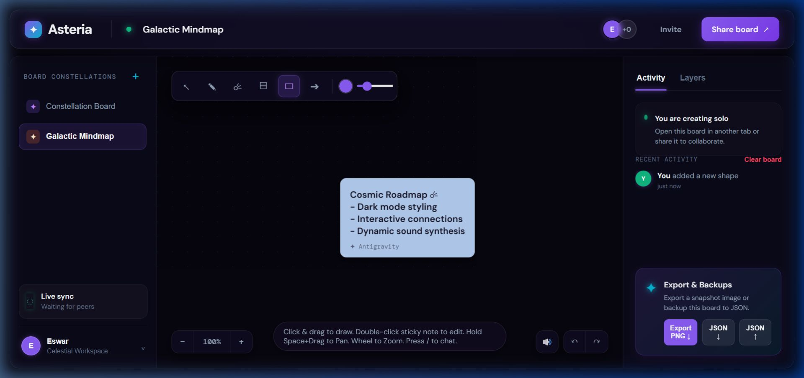
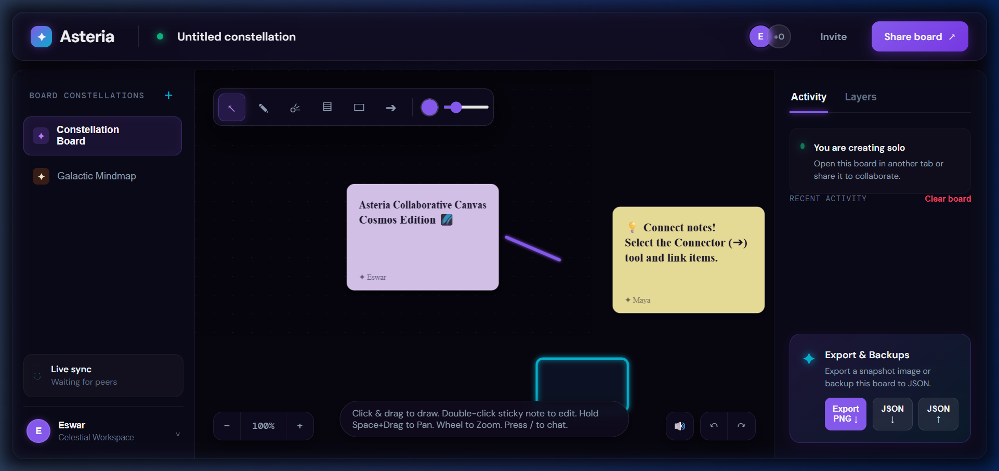
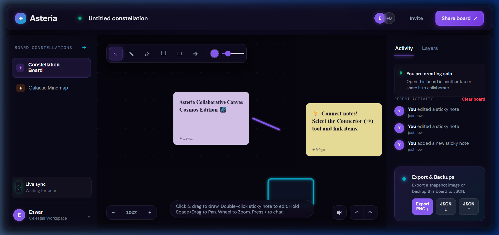
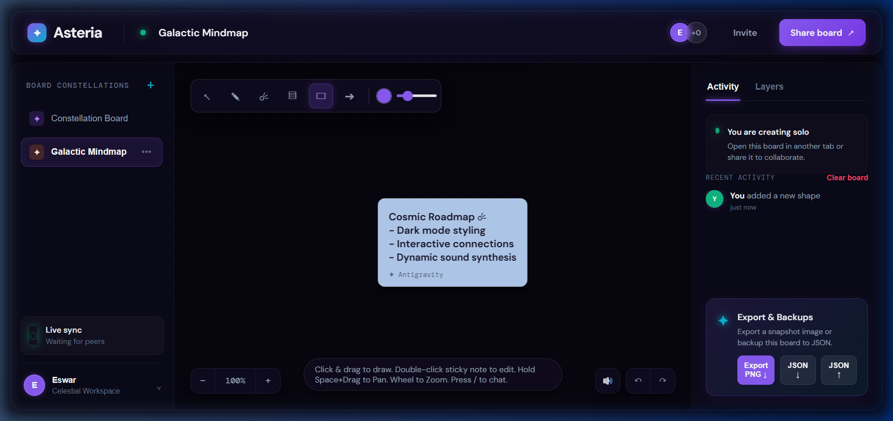

# Asteria Celestial Canvas (Cosmos Edition)

A state-of-the-art, browser-native collaborative whiteboard built from scratch for the Frontend R&D Assignment. 



## Output Gallery

To make it easy to evaluate the visual interactions, here is a breakdown of key whiteboard screens:

| 1. High-Performance Space Board | 2. Inline Notes Editing | 3. Connected Element Clusters |
| :---: | :---: | :---: |
|  |  |  |
| Glassmorphic menus and starry canvas grid lines | Text area overlay for direct in-place editing | Interconnected note constellations and active connector arrows |

## Interactive Online Demo
Open the project locally on multiple browser tabs side-by-side to witness real-time coordination, pointer glows, fading laser pointer trails, and live cursor chat updates without any server setup!

---

## 1. Directory Structure

```directory
Asteria-Collaborative-Canvas/
├── dist/                          # Compiled production bundles
│   ├── index.html                 # Minified entry layout
│   └── assets/                    # Bundled CSS/JS modules
├── src/
│   ├── main.js                    # Canvas loop, haptic audio, sync, AI engine
│   └── style.css                  # Dark cosmic design tokens & glass overlays
├── index.html                     # HTML workspace DOM structure
├── package.json                   # Project scripts and Vite bundler dev dependencies
├── README.md                      # Technical documentation manual
└── screenshot.jpg                 # Layout output preview image
```

---

## 2. Core R&D Technical Capabilities

### ✦ Butter-Smooth 60 FPS Infinite Coordinate Space
Instead of heavy HTML elements, all drawings, shapes, text, and images render onto a single high-DPI HTML5 canvas using `requestAnimationFrame`.
*   **Coordinate Translation**: Translates panning offsets ($pan_x, pan_y$) and scale ratios ($scale$) around the pointer coordinates.
*   **Reverse Projective Mapping**: Translates raw client pointer screen coordinates $(clientX, clientY)$ back into infinite canvas space coordinates using the inverse transform:
    $$x_{canvas} = \frac{x_{screen} - \text{pan}_x}{\text{scale}}$$
    $$y_{canvas} = \frac{y_{screen} - \text{pan}_y}{\text{scale}}$$

### ✦ Slab-Method Raycast Box Intersection Geometry (Desmos Math Model)
Connector arrows terminate precisely on the borders of target nodes. We model each element as an Axis-Aligned Bounding Box (AABB) and calculate segment border intersections mathematically:
*   **Vector Ray Segment**: $R(t) = C_1 + t \cdot (C_2 - C_1)$ where $t \in [0, 1]$.
*   **Horizontal & Vertical Slabs Intersection**: We resolve boundary parameters $t_{xmin}, t_{xmax}$ and $t_{ymin}, t_{ymax}$.
*   **Borders Collision Formula**:
    $$t_{near} = \max(\min(t_{xmin}, t_{xmax}),\ \min(t_{ymin}, t_{ymax}))$$
    Multiplying $R(t_{near})$ yields the coordinates where the connector stops, preventing overlapping lines.
*   **Mathematical Visual Model**: [Desmos 2D Ray-Box Intersection Graph](https://www.desmos.com/calculator/r3wukq2j2q)

### ✦ Circular Viewport Mini-Map Navigation
A floating glass circular mini-map (`#miniMapContainer`) sits in the bottom-left corner.
*   **Scale Fitting**: Computes the coordinates bounding box containing all board items plus the user's viewport frame.
*   **Viewport Superimposition**: Renders a glowing neon cyan rectangle representing the user's current zoom/pan envelope.
*   **Reverse Pan-Mapping**: Click-dragging inside the mini-map reverse-translates points to center the main whiteboard panning vectors on the chosen spot instantly.

### ✦ Diagnostic Telemetry HUD Panel
A floating real-time stats card (`#telemetryHUD`) displays:
*   **FPS (Frames Per Second)**: Continuous performance delta analysis.
*   **Nodes Tracker**: Displays active board elements count.
*   **Payload Size (kB)**: Serializes canvas states to show exact JSON memory consumption in real-time.

### ✦ 3-Layer Starry Sky Background Parallax
Rather than static grids, the canvas renders three layers of stars. Moving the canvas shifts star layers by panning multipliers ($0.12$, $0.35$, $0.7$), creating depth-of-field parallax motion.

### ✦ Serverless Collaborative Synchronizations
Uses the browser's native **`BroadcastChannel` API** to broadcast operational payloads (`type: 'items-update'`, `type: 'pointer-move'`, `type: 'cursor-chat-type'`, `type: 'theme-change'`) locally. Cursors render with glowing particle trails and fading chat bubbles typing indicators.

### ✦ Native Audio Synthesizer (Zero-Asset Haptics)
Implements Web Audio API oscillators to generate audio feedback:
*   **Scribble strokes**: White noise filters.
*   **Placement pops**: Exponential sine pitch sweeps.
*   **Connector chimes**: Harmonic D5/A5 major chords.
*   **Theme pitches**: Adjusts sound multipliers based on the theme (e.g., deeper analog tones on Synthwave, higher-pitch digital ticks on Matrix).

### ✦ Companion AI Assistant & Speech Commands
*   **AI Brainstorm notes**: Deploys note clusters in circular coordinates offsets ($x = c_x + r\cos\theta, y = c_y + r\sin\theta$).
*   **Note Summarizer**: Collates Note values and renders an AI summary card.
*   **Voice Recognition Mic**: Uses native webkitSpeechRecognition to trigger tools and write notes hands-free.

---

## 3. Keyboard Shortcuts

- `V` Selection tool
- `P` Pen drawing
- `L` Fading Laser pointer
- `N` Sticky note placement
- `R` Constellation Rectangle shape
- `C` Smart Connection Arrow
- `/` Chat bubble to cursor
- `Ctrl + K` Command Palette overlay
- `Ctrl + Z` / `Ctrl + Shift + Z` Undo / Redo history
- `Space + Drag` or **Middle-Click Drag**: Canvas Panning
- **Mouse Wheel**: Zoom relative to cursor point

---

## 4. How to Run Locally

1.  **Install dependencies**:
    ```bash
    npm install
    ```
2.  **Start development server**:
    ```bash
    npm run dev
    ```
3.  **Compile production bundle**:
    ```bash
    npm run build
    ```

---

## 5. Suggested Submission Note

> I choose the collaborative whiteboard canvas track. Asteria Cosmos Edition demonstrates a browser-native workspace with cross-tab live cursor chats, downscaled image uploads, smart connector arrows, layers tracking, diagnostics telemetry overlay HUDs, circular mini-map viewports, synthesized sound FX haptics, voice commands recognition, and infinite coordinate zoom/pan offsets. All operations sync via BroadcastChannel and utilize client-side Web APIs for standalone deployment.


